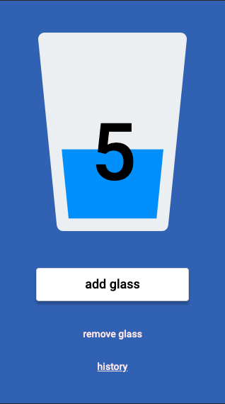

# Simple PWA application - HYDRAA

Here is working app - feel free to test it: [Hydraa](http://jundymek.github.io/hydrapp)

It is homework from [WTF](https://cotenfrontend.pl) frontend course.

It is my first PWA app ever. Add a glass of water using the "add glass" button. Subtract it by using the "remove glass" button. Data is stored in local storage (each day has its data). You can look at history on history subpage (history link).

Tehnologies and tools used in this project 🚀:
- HTML5
- CSS3 
    - flexbox 
    - sass (scss syntax)
    - transitions (animate SVG image)
- JS ES6
- Visual Studio Code
- Figma (layout design)
- GULP
- GIT
- Node.js / NPM

